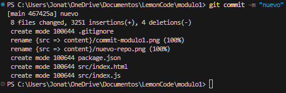
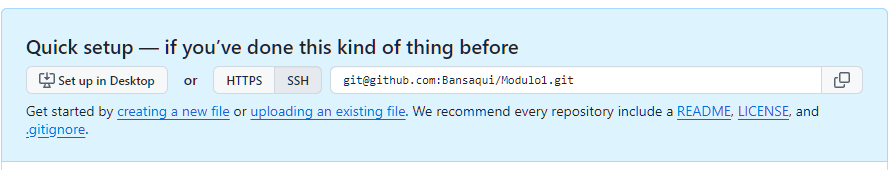

# Laboratorio de Git

### Entrega del modulo 1 que está basada en Git.

1. ## Crear un repositorio en local

   - Abrimos la terminal Git Bash y usamos el comando: > $ cd ..
   - Una vez que estamos en la carpeta donde queremos crear la nueva usaremos el siguiente comando: > mkdir Modulo1
   - Ahora ingresamos (CD modulo1)
   - Instalamos las dependencias: npm install y acontinuación un npm start para iniciar el proyecto.
   - Y por último realizamos un git init --- Luego lo pasamos a staging los cambios con git add . y finalizamos con git commit -m "mensaje" para guardarlo en Git local

   

    

2. ## Subir el repositorio a Git

   - Vamos a la página de GitHub
     [Visitar la web GitHub](https://github.com/)
     Creamos un nuevo repositorio.

     Le ponemos un nombre (Modulo1) Vamos a ponerlo privado para que tengamos que autenticarnos para la descarga y NO añadiremos un README.md para subir "Este mismo"

     Copiamos la clave SSH una vez configurado.
     

     Ahora en la terminal y estando en la carpeta escribimos: git remote add origin git@github.com:Bansaqui/Modulo1.git

     Para subir de local a GitHub pondremos: git push -u origin main (tuve que poner main en vez de master)

     Actualizamos GitHub y veremos los cambios realizados.

3. ## Hacer un commit y un push

   - Añadiremos un archivo nuevo llamado "NuevoReadme.md"

   - Lo pasamos al staging git add .

   -Creamos el commit: git commit -m "nuevo archivo Readme"

   - Para subir los cambios: git push
   - pero antes debes de hacer esto: git push --set-upstream origin main para establecer relación entre la rama local y la remota
