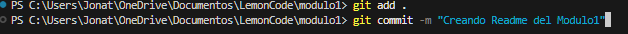

# Laboratorio de Git

### Entrega del modulo 1 que está basada en Git.

1. ## Crear un repositorio en local

   - Abrimos la terminal Git Bash y usamos el comando: > $ cd ..
   - Una vez que estamos en la carpeta donde queremos crear la nueva usaremos el siguiente comando: > mkdir Modulo1
   - Ahora ingresamos (CD modulo1)
   - Y por último realizamos un git init --- Luego lo pasamos a staging con git add .

   

2. ## Crear un repositorio en local

   -
